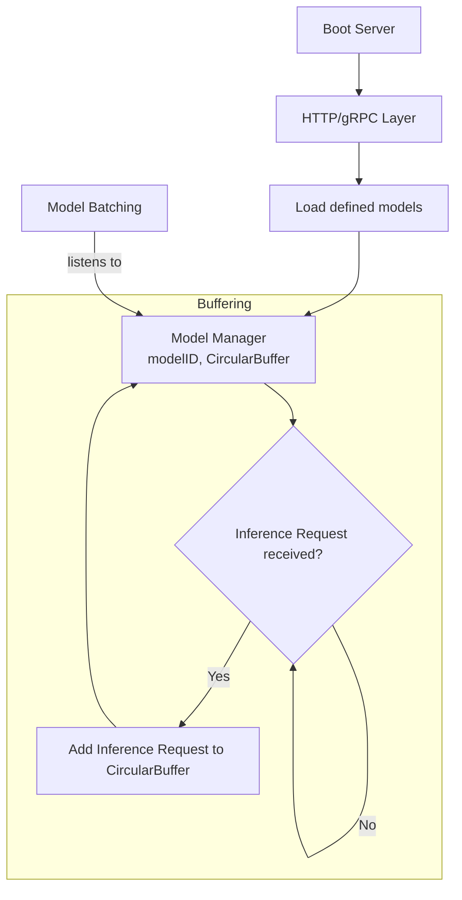

## Circular Buffer.

```mermaid
flowchart TD
    A[Boot Server] --> B
    B[HTTP/gRPC Layer] --> C
    C[Load defined models] --> D[Model Manager
    modelID, CircularBuffer]
    subgraph "Buffering"
        D --> E{Inference Request received?}
        E -- Yes --> F[Add Inference Request to CircularBuffer]
        E -- No --> E
        F --> D
    end
    G[Model Batching] -- listens to --> D
```